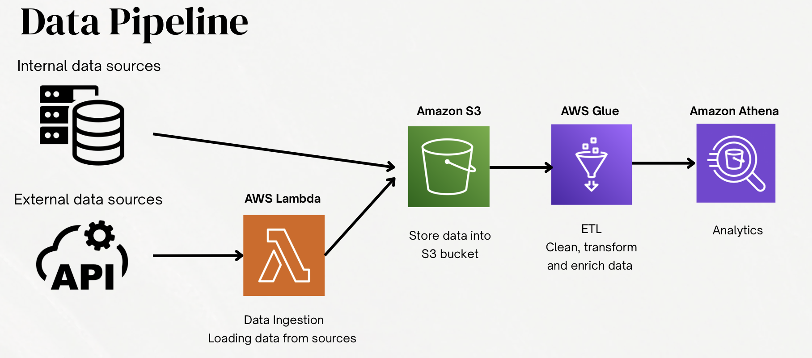
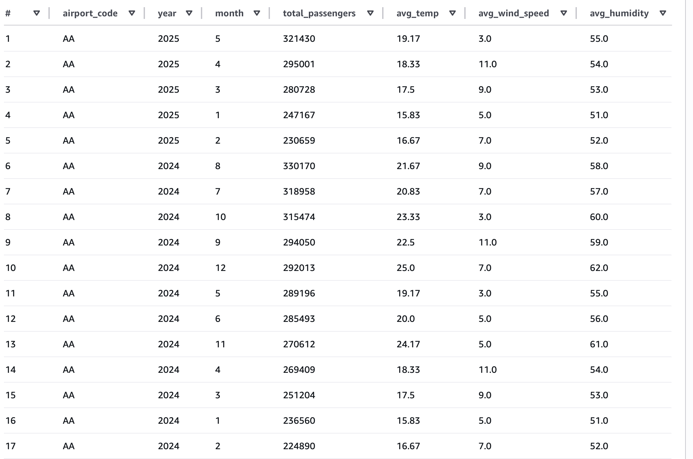
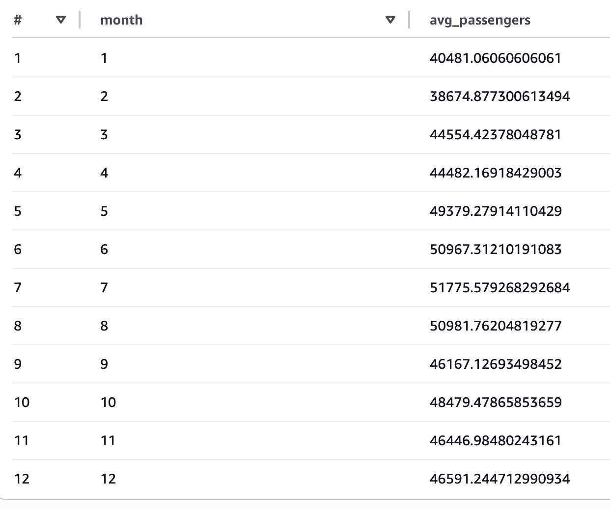
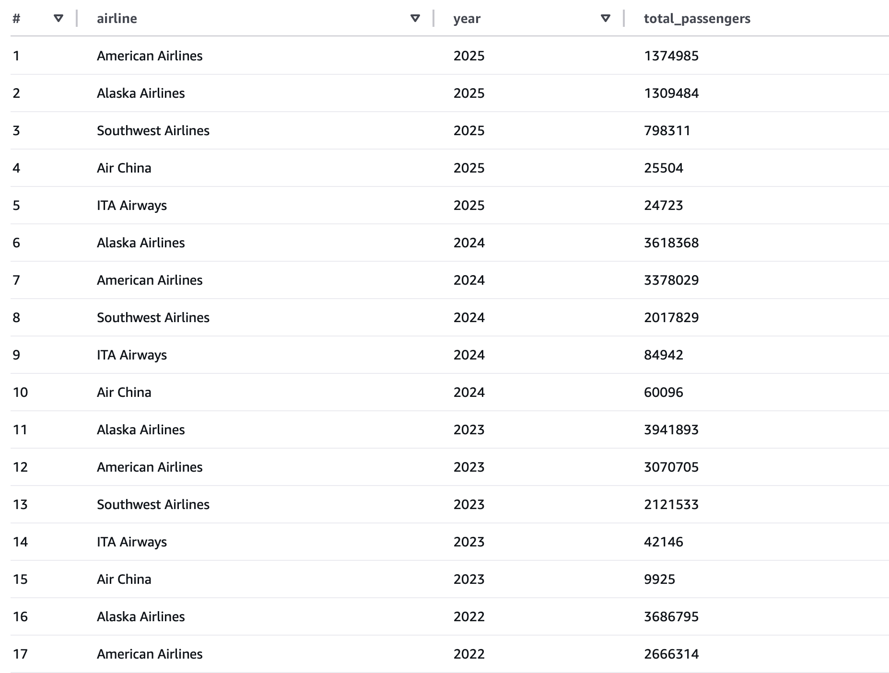

# Large-Scale Data Architecture: US Flight Traffic & Weather Analysis

## Project Overview
As a travel agency in the United States, understanding flight traffic patterns and the impact of weather conditions is essential for anticipating changes in travel demand. Passenger volume varies throughout the year due to seasonal weather, holidays, and traveler behavior, creating clear peak and off-peak seasons.  

This project analyzes historical air traffic passenger statistics for 5 major U.S. airports from 1999 to 2025, combining passenger counts with weather and time factors to identify recurring travel patterns and predict upcoming peak seasons. These insights help travel agencies plan promotions, vouchers, and operational resources in advance, enabling more data-driven marketing strategies and improved customer service.

---

## Stakeholders & Value

### Marketing Department
- Plan campaigns and promotions based on demand patterns.
- Offer vouchers or special deals during peak periods to attract more customers.
- Increase campaign effectiveness through targeted timing.

### Operations Manager
- Optimize staff and resource allocation during high-demand periods.
- Ensure smooth airport operations, including check-ins and boarding.
- Anticipate seasonal spikes in passenger traffic.

### Sales Team
- Focus on high-demand periods and popular destinations.
- Identify opportunities for upselling and creating customized travel packages.
- Align offers with customer behavior to increase revenue.

---

## Pipeline Architecture

### Data Collection
- Flight traffic data collected from CSV files.
- Weather data retrieved via an external API.
- AWS Lambda triggers the API automatically to fetch the latest weather data.
- Datasets are combined to analyze how weather affects passenger traffic.

### Data Storage (Amazon S3)
- Raw and processed data stored in S3 for scalability and durability.
- Provides centralized access to multiple teams without duplication.
- Supports future analysis and historical data retention.

### Data Processing (AWS Glue)
- Cleans, transforms, and merges flight and weather datasets.
- Creates a structured format for analysis and reporting.
- Catalogs the data for easy querying and consistent access.

### Data Analysis (Amazon Athena)
- Queries processed data directly from S3 using SQL.
- Explores passenger trends, seasonal variations, and weather effects.
- Supports marketing, operations, sales, and customer service decisions.

---

## Cost Estimate

| Service        | Cost Details                                                                 | Estimated Monthly Cost |
|----------------|----------------------------------------------------------------------------|----------------------|
| Amazon S3      | 10 GB data storage + requests                                              | $0.28                |
| AWS Lambda     | Triggering weather API (low requests within free tier)                     | $0                   |
| AWS Glue       | ETL job (1 hour/day using 1 DPU)                                          | $13.20               |
| Amazon Athena  | Querying ~50 GB of processed data per month                                | $0.25                |
| **Total**      |                                                                              | **$13.73**           |

> The pipeline is cost-effective due to serverless architecture, paying only for resources used while remaining scalable as data volume grows.

---

## Business Goals Supported
- Forecast peak travel periods for operational efficiency.
- Enable data-driven decisions for promotions, travel packages, and marketing strategies.
- Anticipate high-demand periods and potential disruptions to improve customer satisfaction.
- Leverage serverless services to maintain cost efficiency and scalability.

---

## Key Performance Indicators (KPIs)

1. **Monthly Passenger Volume Associated with Weather Conditions**
   - Measures passenger traffic variation by weather and airport.
   - Helps prepare services like airport transfers, staff allocation, and promotions.

2. **Average Passenger Volume Per Month**
   - Identifies peak and off-peak travel seasons.
   - Supports marketing campaigns, promotions, and resource planning.

3. **Yearly Passenger Volume Per Airline**
   - Tracks airline popularity and customer loyalty trends.
   - Informs partnerships, package deals, and targeted marketing strategies.

> Together, these KPIs help optimize operational planning, marketing strategies, and customer service, ultimately increasing efficiency, satisfaction, and revenue.

---

## Technologies Used
- **Amazon S3** – Data storage and durability  
- **AWS Lambda** – Weather API automation  
- **AWS Glue** – ETL and data processing  
- **Amazon Athena** – Serverless SQL queries on S3  

---

## Implementation
### Execution Process
- The execution begins with the creation of two S3 buckets: one to store flight traffic CSV files and another to store weather data retrieved from the Open Weather API. The weather data is collected using an AWS Lambda function, which retrieves weather information for the five major airports in the US. The Lambda function does not rely on manual API calls; instead, it is automated and serverless, allowing the system to fetch data on a scheduled basis or in response to an event. Once the Lambda function retrieves the weather data, it stores the results directly in the designated S3 bucket in a structured format, ready for further processing.

- After creating two S3 buckets for the different types of datasets, the flight data is stored in CSV format, while the weather data retrieved from the API is stored in JSON format. Since JSON is semi-structured, it needs to be transformed into a column-oriented format to enable efficient querying later. To handle this, the first AWS Glue job was created, which cleans, parses, and converts the JSON weather data into a structured, query-ready format compatible with Athena.

- Five major airports weather data are saved seperately in the weather folder of S3. To make it easier to query, those five files should be merge by the following second ETL jobs

- After using AWS Glue ETL jobs to clean, transform, and merge the flight and weather datasets, an AWS Glue crawler is run to automatically scan the processed data stored in S3. The crawler detects the schema, identifies column names and data types, and creates or updates tables in the AWS Glue Data Catalog. This step ensures that the data is properly structured and ready for analysis. By automating the schema detection and cataloging process, the crawler reduces manual effort and ensures that the latest data is always accessible for reporting and business insights.

- Two table were created in my database which are traffic flight data and weather data.

### Results
- **KPI 1** – Monthly Passenger Volume Associated with Weather Conditions in Each Airport
 

The data for the example airport AA shows that passenger traffic varies throughout the year, with higher volumes during the summer months and lower volumes in the winter. This pattern corresponds closely with weather conditions, as months with higher average temperatures tend to have more passengers, while cooler months see fewer travelers. Wind speed and humidity show some variation but appear less influential than temperature. Understanding these trends allows the travel agency to anticipate which months the airport will be more crowded, enabling proactive planning of services such as taxi vouchers, airport transfers, and additional staff. By linking passenger volumes to weather patterns, the agency can improve operational efficiency and enhance the overall customer experience.

- **KPI 2** – Average passenger volume per month
 

 The monthly passenger data reveals a clear seasonal pattern in travel demand. Passenger volumes peak in July and August, with averages of approximately 51,776 and 50,982, respectively, indicating the busiest travel period, likely corresponding to summer holidays. Moderate demand is observed in May and June, while the lowest passenger numbers occur in January and February, suggesting a slower winter period. From a business perspective, this information is critical for strategic planning. Marketing efforts and promotions can be targeted during low-demand months to stimulate travel, while premium services and seasonal packages can be emphasized during peak months to maximize revenue. Operational planning can also be optimized: staffing levels, fleet allocation, and customer service resources should be increased during high-demand periods to maintain service quality, while off-peak months provide opportunities for maintenance or cost-saving measures. Furthermore, revenue management strategies, such as dynamic pricing during peak periods and discounts during slow months, can help maximize profitability

 - **KPI 3** – Yearly passenger volume per airlines
 

The yearly passenger data highlights airline popularity and market trends. American Airlines and Alaska Airlines consistently lead in passenger volume, indicating strong customer preference and loyalty, while Southwest Airlines maintains moderate demand, and Air China and ITA Airways have limited market presence. For the agency, this insight can guide strategic decisions such as forming partnerships with high-demand airlines, creating targeted promotions or travel packages, and allocating marketing resources to attract or retain passengers. Leveraging these trends can improve revenue, enhance customer satisfaction, and strengthen competitive positioning in the airline market.

---

## License
This project is licensed under the MIT License.
